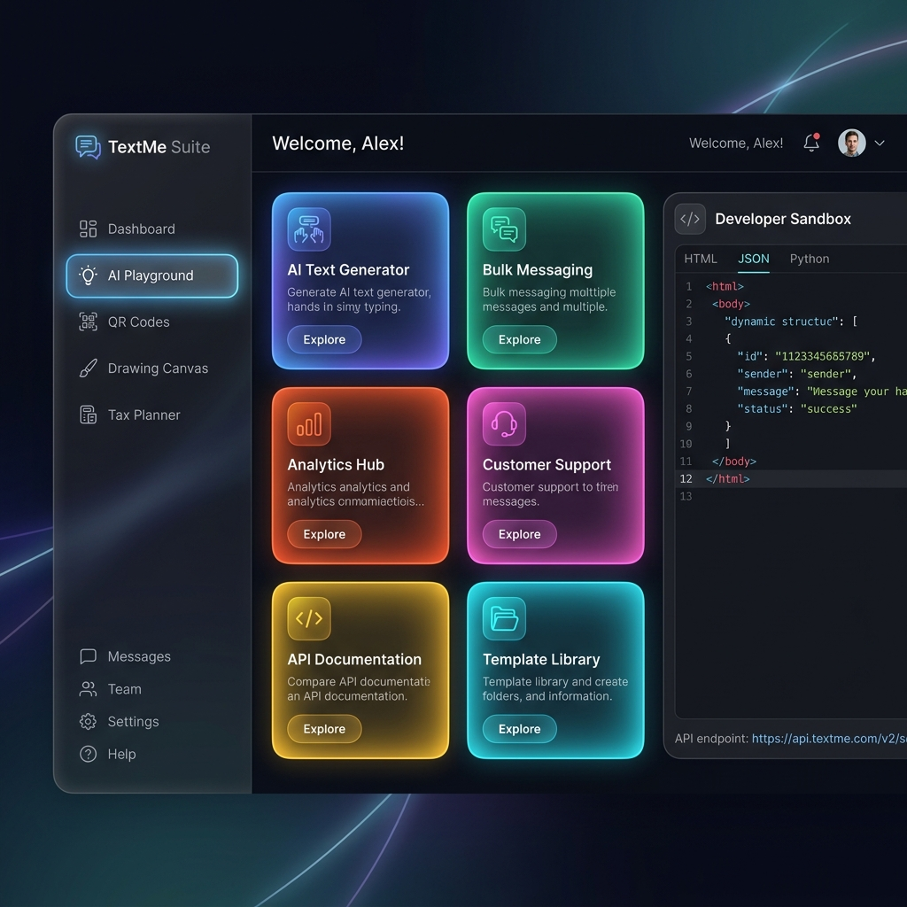

# 🤖 TextMe Suite — All-in-One Utility Hub & AI Sandbox

> **TextMe Suite** is an enterprise-grade SaaS-style productivity application combining **18+ custom-built developer tools, creative modules, mapping canvases, and Generative AI playgrounds** into a unified, high-performance web dashboard. 

Built using a modern React 18, TypeScript, and Redux Toolkit architecture, this suite is wrapped in a beautiful, responsive glassmorphic shell utilizing Framer Motion animations and custom HSL styling.

---

## 🎨 Interactive Dashboard Preview



---

## 🚀 Key Modules & Feature breakdown

TextMe Suite organizes powerful utilities under curated categories. All tools are fully responsive, support local storage caching, and are optimized for high-performance client-side execution.

### 🧠 1. AI & Innovation
*   **🤖 AI Playground (Gemini Chat)**: Live prompt engineering chat interface powered by the `@google/genai` SDK (`gemini-2.0-flash` model). Renders streaming markdown and code blocks with live Prism syntax highlighting. Supports client-side chat persistence (local storage).
*   **🎛️ Notes Playground (OpenAI Sandbox Mockup)**: Sandbox modeled after the OpenAI Playground. Includes adjustable parameters for temperature, top-p, and max-token thresholds, plus a system prompt injector and custom preset savers.

### 🛠️ 2. Utility Suite
*   **🎚️ Dynamic QR Hub**:
    *   **QR Generator**: Instantly generate styled static QR codes from text, Wi-Fi keys, emails, SMS texts, and contact cards. Supports linear/radial gradient coloring and centered logo overlay.
    *   **Real-Time Scanner**: Decodes QR codes using your device's webcam (`html5-qrcode`).
    *   **QR Decoder**: Drag-and-drop file uploader to read QR structures locally.
    *   **Dynamic QRL**: Create dynamic redirect pathways for QR codes, mapping destination links on the fly.
*   **🔍 Image Text Extractor (OCR)**: Crop-capable document text scanner using `tesseract.js`. Users can crop uploaded images to extract text from a targeted region instead of processing the entire image.
*   **📑 PDF Editor**: Upload and overlay text annotations, relocate nodes, customize layouts, and save modifications back to PDF binary structures using `pdf-lib` and `react-pdf`.
*   **🧾 Invoice Generator**: Interactive billing composer to structure invoices, calculate subtotals automatically, and export print-ready PDFs.
*   **🌦️ Live Weather Dashboard**: Searches cities globally to fetch temperature logs, precipitation metrics, wind velocities, and detailed charts (using Recharts).
*   **🔗 Government Services Directory (GovLink)**: Directory mapping with shortcuts and search capability for government service portals.

### 🎨 3. Creative & Visualization
*   **✏️ Vector Sketchboard (Excalidraw)**: Infinite-canvas vector whiteboard. Sketch interface mocks, chart database architectures, and export layouts to PNG/SVG. Autosaves drawings.
*   **📊 Family Tree Graph**: Visual drag-and-drop lineage chart powered by `@xyflow/react` (React Flow). Add parents, children, and spouses using custom cards with responsive connectors.
*   **📈 Project Dependency Graph**: Dependency visualizer showcasing React component relationships and state logic pathways using visual node workflows.
*   **📍 Local Map Business Finder**: Geospatial locator powered by Leaflet maps (`react-leaflet`). Features search query lists, business category pins, dynamic marker additions, and custom floating map docks.

### 📅 4. Productivity & Commerce
*   **📝 Form Builder**: Visual no-code builder. Drag-and-drop form fields (text inputs, checkboxes, radio selections, dates), construct custom label elements, and download structured JSON forms or response tables. Includes interactive tours (`react-joyride`).
*   **🧮 Indian Tax Planner**: Compares Old vs New Tax regimes. Calculates standard deductions, Section 80C investments, 80D insurance policies, 80E educational interests, 80CCD NPS limits, and outputs recommendations with visual breakdown tables.
*   **📝 Rich Block Text Editor**: Clean page composer integrating Editor.js to write structured articles, checklist items, header trees, and download files directly.
*   **📅 Event Scheduler**: Interactive monthly calendar powered by `react-big-calendar`. Plot deadlines, schedule task dates, and manage project timelines.
*   **🛒 Commercial Product Catalog**: Retail e-commerce layout containing mock shopping carts, subtotal checkouts, and clean product lists.
*   **✅ Task List (To-Do)**: Quick checklist dashboard to register, update, and manage tasks.

---

## 🛠️ Technology Stack & Architecture

TextMe Suite is built with premium developer aesthetics and clean architecture patterns:

*   **Frontend Library**: [React 18](https://react.dev/) + [TypeScript](https://www.typescriptlang.org/)
*   **Build Tool**: [Vite](https://vitejs.dev/) (Sub-second hot-module reloading and optimized production bundling)
*   **State Management**: [Redux Toolkit](https://redux-toolkit.js.org/) (Handles global theme states, settings, and task data)
*   **Routing**: [React Router v6](https://reactrouter.com/) (Declares nested layouts, routing guards, and path parameters)
*   **Styling & UI Components**: [Tailwind CSS](https://tailwindcss.com/) + [Radix UI primitives](https://www.radix-ui.com/) + [Lucide Icons](https://lucide.dev/)
*   **Motion & Effects**: [Framer Motion](https://www.framer.com/motion/) (Enables fluid sidebar toggles, card fades, and route transitions)
*   **Testing Suite**: [Vitest](https://vitest.dev/) + [React Testing Library](https://github.com/testing-library/react-testing-library)

---

## 📂 Project Structure

```bash
src/
├── app/                  # Redux store configurations & hooks
├── assets/               # Local images & custom SVG assets
├── components/           # Reusable global layout elements & AppShell wrapper
├── features/             # Redux slices, state APIs, and core domain business logic
│   ├── FamilyTree/       # Node rendering & structural mapping
│   ├── auth/             # Login sessions & auth token management
│   ├── draw/             # Sketchboard RTK endpoints
│   ├── editor/           # Document composing API hooks
│   └── ...
├── hooks/                # Custom React hook utilities
├── lib/                  # Theme styling templates & helper utils
└── pages/                # Individual page workspaces & custom child views
    ├── AiPlayground/     # Gemini Chat playground
    ├── DynamicForm/      # Form Builder with Joyride tour elements
    ├── OCR/              # Text scanner with canvas cropping tool
    ├── PlanTax/          # regime comparer & Indian tax calculators
    └── ...
```

---

## ⚙️ Getting Started & Setup

Follow these steps to spin up the TextMe Suite workspace locally:

### 1. Clone the Repository
```bash
git clone https://github.com/[username]/textme.git
cd textme
```

### 2. Install Dependencies
```bash
npm install
```

### 3. Setup Environment Variables
Create a `.env` file in the root directory:
```env
VITE_GEMINI_API_KEY=your_gemini_api_key_here
```

### 4. Run the Development Server
```bash
npm run dev
```
The application will launch on [http://localhost:5173](http://localhost:5173).

### 5. Running Tests
Run the Vitest assertion checks:
```bash
npm run test
```

### 6. Linting & Formatting
Enforce formatting guidelines:
```bash
npm run lint
npm run format
```

---

## 👨‍💻 Author

Developed with ❤️ by Anurag Chindaliya. Designed to showcase modern web engineering, clean component orchestration, and responsive user experience design.
